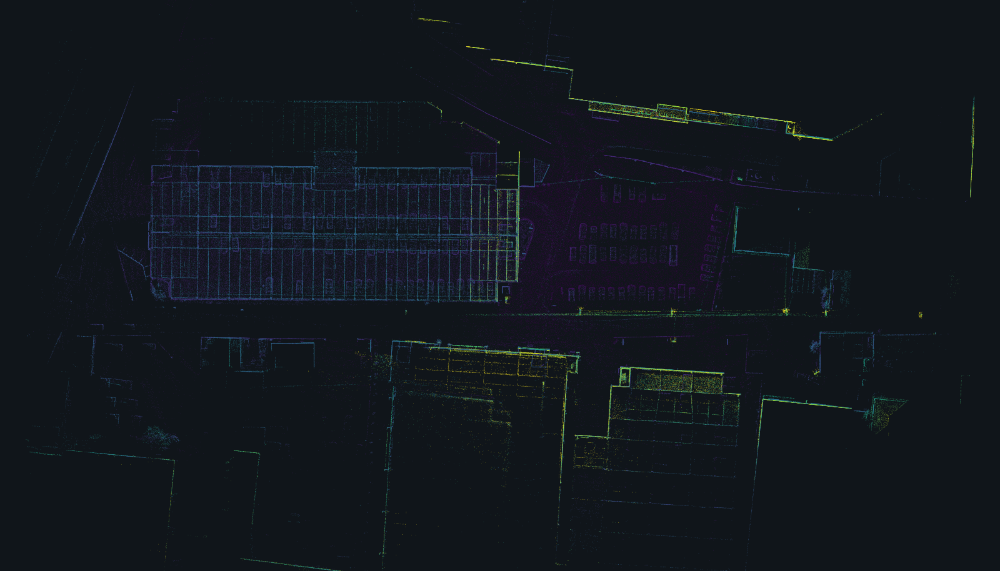
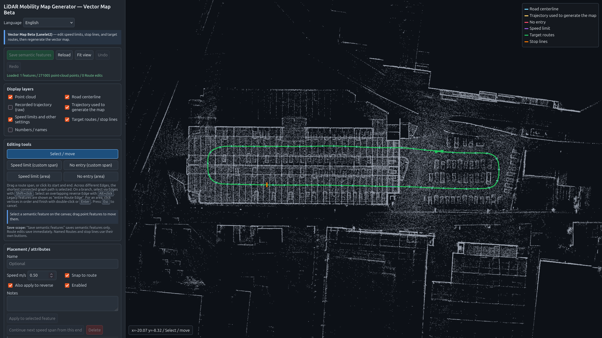
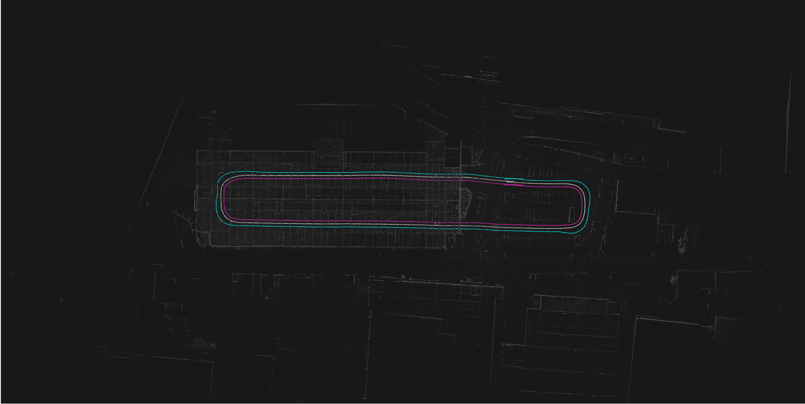
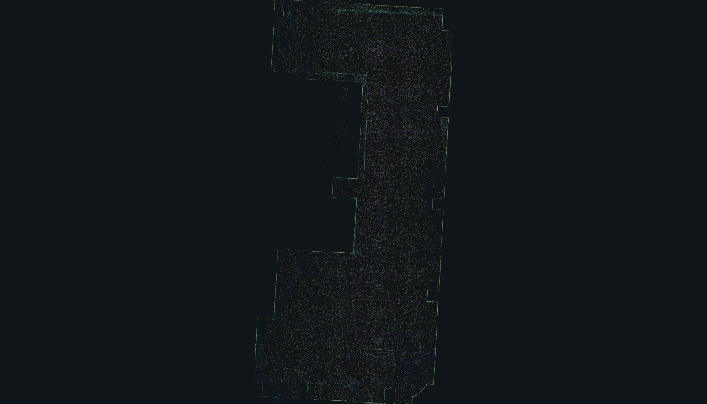
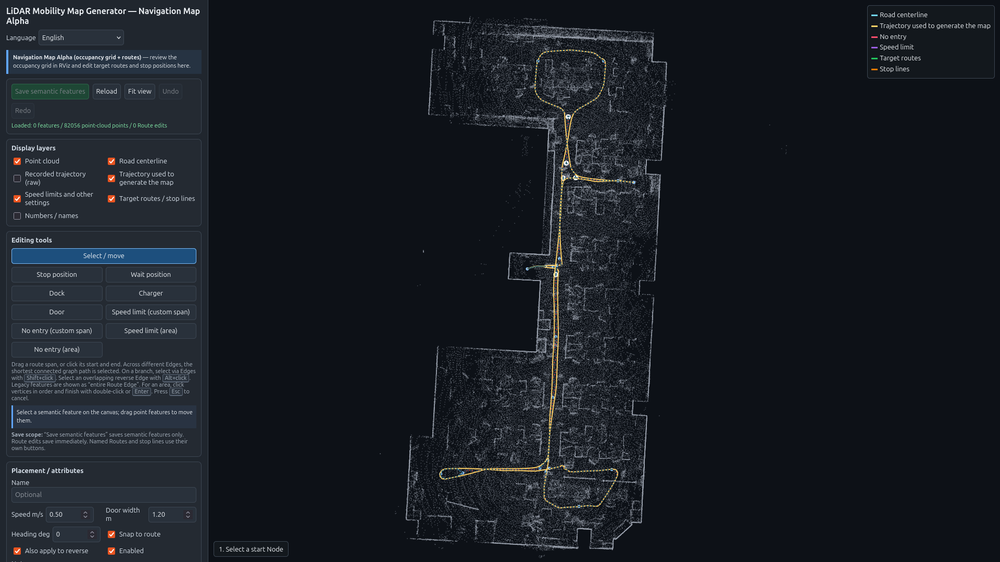
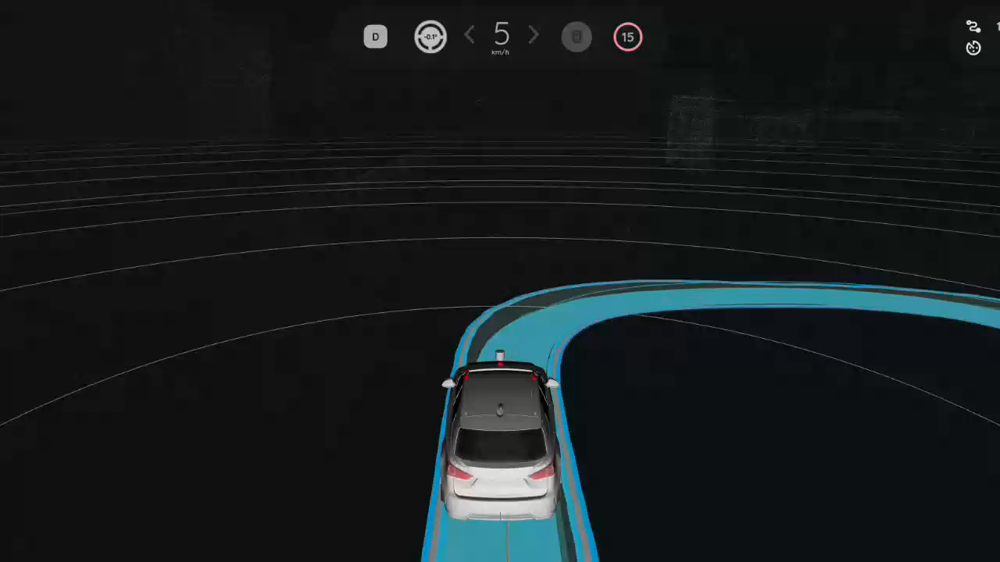
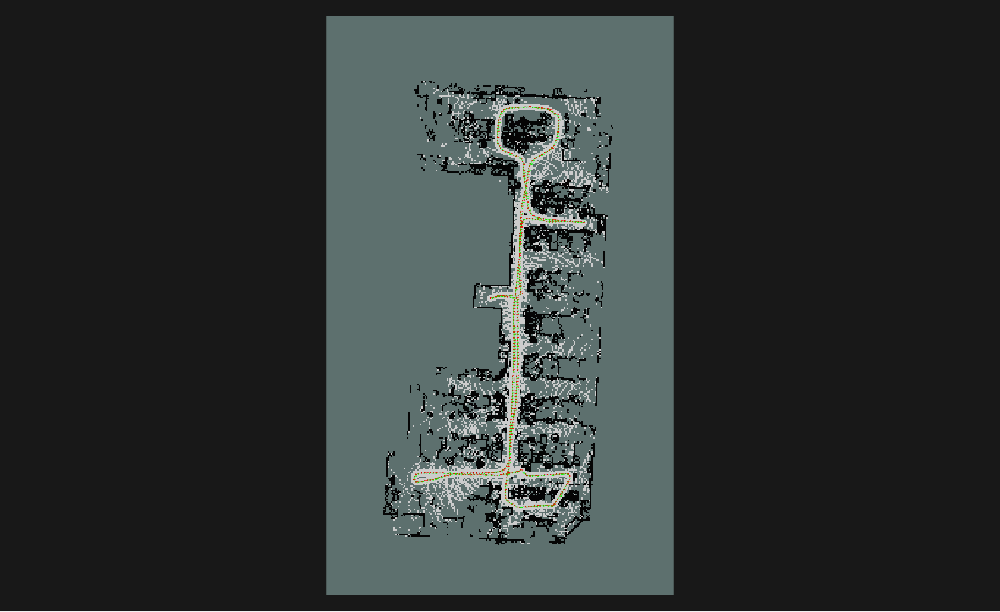

# LiDAR Mobility Map Generator

**English** | [日本語](README_ja.md)

LiDAR Mobility Map Generator is a map-generation tool for autonomous vehicles
and autonomous mobile robots operating in closed areas and free spaces. It
accepts either LiDAR SLAM output (a point-cloud map and the trajectory estimated
by SLAM) or rosbag2 data (3D LiDAR point clouds and localization estimates), and
automatically generates Vector Maps and Navigation Maps.

Version 0.11.0, dated September 5, 2026, is the project's first public
release. The Vector Map workflow remains a beta feature for evaluation in
controlled, closed-course environments, and the Navigation Map workflow
remains alpha.

## Main Features

- **Vector Map (Lanelet2, beta):** automatically generates Vector Maps for
  autonomous driving and mobile robotics from LiDAR SLAM output or rosbag2. In
  the Web GUI, users can add a target route, speed limits, and virtual stop
  lines.
- **Navigation Map (alpha):** automatically generates a 2D occupancy-grid map
  and route data. The outputs can be loaded by map and route servers, including
  the Nav2 Map Server and Route Server, and displayed in RViz2.

## Characteristics

The tool creates Vector Maps and Navigation Maps for closed areas, free spaces,
and private sites where map features such as target routes, speed limits, and
stop lines do not yet exist. Using LiDAR SLAM output or rosbag2 recordings, it
supports map creation for transport, patrol, delivery, and other systems that
follow specific routes.

The output formats are compatible with widely used open-source software,
including Autoware® and Nav2. Operation has been verified with data from
representative LiDARs, including Hesai, Velodyne, and Livox MID-360.

## Example Results

### Vector Map Example

**Input Point-Cloud Map**



**Vector Map Editor**



**Generated Lanelet2 Map**



### Navigation Map Example (MID-360)

**Input Point-Cloud Map (MID-360)**



**Navigation Map Editor (MID-360)**



## Map Usage Examples

### Using a Vector Map with Autoware



[Watch the driving video (18 seconds)](https://github.com/user-attachments/assets/bb0da7f7-8c39-4d5f-9147-96d45e3e6e5f)

### Displaying a Navigation Map with Nav2 (MID-360)



## Environment

- Ubuntu 24.04
- ROS™ 2 Jazzy
- C++17
- Supported data:
  - a point-cloud map in PLY or PCD format and a trajectory in TUM format; or
  - rosbag2 containing `PointCloud2` and localization estimates.
- Verified inputs:
  - For rosbag2 input, map generation has been verified with Hesai, Velodyne,
    and Livox MID-360 data using localization estimates produced by
    [gicp_gnss_odom_localizer](https://github.com/KariControl/gicp_gnss_odom_localizer).
  - For LiDAR SLAM output, map generation has been verified with output from
    [GLIM](https://github.com/koide3/glim).

## Build

```bash
export LMMG_WS="$HOME/lmmg_ws"
mkdir -p "$LMMG_WS/src"
git clone https://github.com/KariControl/lidar_mobility_map_generator.git \
  "$LMMG_WS/src/lidar_mobility_map_generator"

source /opt/ros/jazzy/setup.bash
cd "$LMMG_WS"
rosdep install --from-paths src --ignore-src -r -y
colcon build --symlink-install --packages-select lidar_mobility_map_generator
source "$LMMG_WS/install/setup.bash"
```

## Detailed Usage

- [Map Creation and Editing Operator Manual](docs/operator_manual.md)

## Notes

The generated left and right Lanelet boundaries are not surveyed road
boundaries. They define a virtual travel corridor derived from an automatically
generated or GUI-selected centerline and the specified vehicle dimensions. Use
measured values for the vehicle or robot dimensions and LiDAR extrinsics, and
review the generated map before use.

## License

Apache License 2.0. See [LICENSE](LICENSE).

## Trademarks

Autoware is a trademark of the Autoware Foundation. ROS is a trademark of
Open Source Robotics Foundation. See [TRADEMARKS.md](TRADEMARKS.md) for the
complete trademark and affiliation notice.
