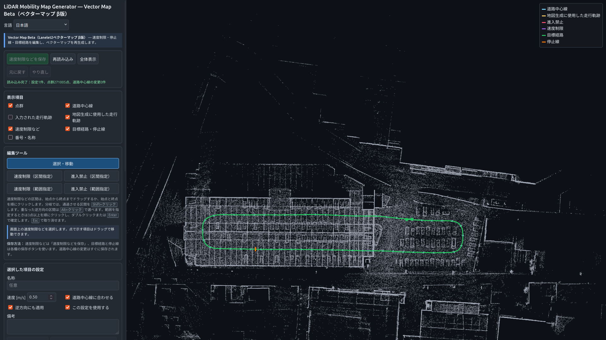
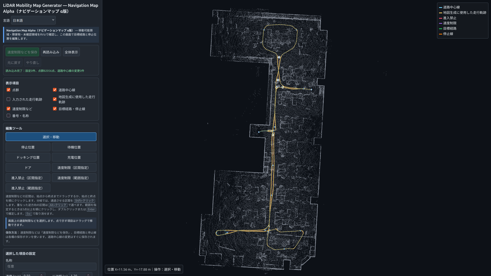

# LiDAR Mobility Map Generator

[English](README.md) | **日本語**

LiDAR Mobility Map Generatorは、閉鎖空間やフリースペースを走行する自動運転車両・
自律移動ロボット向けの地図生成ツールです。LiDAR SLAMの処理結果（点群地図と
自己位置推定軌跡）またはrosbag2（3D LiDAR点群と自己位置推定結果）から、
ベクターマップとナビゲーションマップを自動生成します。

2026年9月5日付のv0.11.0が初回公開版です。ベクターマップ機能は管理された閉鎖コースで
評価するためのβ版、ナビゲーションマップ機能はα版です。

## 主な機能

- **ベクターマップ（Lanelet2、β版）**：LiDAR SLAMの処理結果またはrosbag2から、
  自動運転・自律移動向けのベクターマップを生成します。Web GUIで目標経路、速度制限、
  仮想停止線を追加できます。
- **ナビゲーションマップ（α版）**：2D占有格子地図と経路データを自動生成します。
  Nav2などのMap Server／Route Serverで読み込み、RViz2で表示できます。

## 特徴

目標経路、速度制限、停止線などの地図情報が整備されていない閉鎖空間、フリースペース、
私有地向けの地図を生成できます。LiDAR SLAMまたはrosbag2の走行記録を利用し、運搬、
巡回、配送など、特定ルートを走行するシステム向けの地図作成を支援します。

出力形式はAutoware®やNav2などの代表的なOSSに対応しています。Hesai、Velodyne、
Livox MID-360など、代表的なLiDARのデータで動作を確認しています。

## 生成結果例

### ベクターマップ生成例

**入力点群地図**


**ベクターマップ編集画面**



**生成したLanelet2**


### ナビゲーションマップ生成例（MID-360）

**入力点群地図（MID-360）**


**ナビゲーションマップ編集画面（MID-360）**



## 地図の利用例

### Autowareでのベクターマップ利用


[走行動画を見る（18秒）](https://github.com/user-attachments/assets/bb0da7f7-8c39-4d5f-9147-96d45e3e6e5f)

### Nav2でのナビゲーションマップ表示（MID-360）


## 動作環境

- Ubuntu 24.04
- ROS™ 2 Jazzy
- C++17
- 対応データ：PLYまたはPCD形式の点群地図とTUM形式の軌跡、またはrosbag2の
  `PointCloud2`と自己位置推定結果
- 動作確認した入力：
  - Hesai、Velodyne、Livox MID-360のrosbag2は、
    [gicp_gnss_odom_localizer](https://github.com/KariControl/gicp_gnss_odom_localizer)による
    自己位置推定結果を入力して地図を生成できることを確認しています。
  - LiDAR SLAM処理結果は、[GLIM](https://github.com/koide3/glim)の出力を使って
    地図を生成できることを確認しています。

## ビルド

```bash
export LMMG_WS="$HOME/lmmg_ws"
mkdir -p "$LMMG_WS/src"
git clone https://github.com/KariControl/lidar_mobility_map_generator.git \
  "$LMMG_WS/src/lidar_mobility_map_generator"

source /opt/ros/jazzy/setup.bash
cd "$LMMG_WS"
rosdep install --from-paths src --ignore-src -r -y
colcon build --symlink-install --packages-select lidar_mobility_map_generator
source "$LMMG_WS/install/setup.bash"
```

## 詳しい使い方

- [地図作成・編集 操作マニュアル](docs/operator_manual_ja.md)

## 使用上の注意

生成するLaneletの左右境界線は測量した道路境界ではなく、自動生成またはGUIで選択した
道路中心線と車両寸法から作る仮想的な通行帯の境界です。車体・ロボット寸法とLiDARの外部
キャリブレーションには実測値を使用し、生成結果を確認してください。

## ライセンス

Apache License 2.0です。詳細は[LICENSE](LICENSE)を参照してください。

## 商標

AutowareはThe Autoware Foundationの商標です。ROSはOpen Source Robotics
Foundationの商標です。商標と本プロジェクトの関係については
[TRADEMARKS.md](TRADEMARKS.md)を参照してください。
