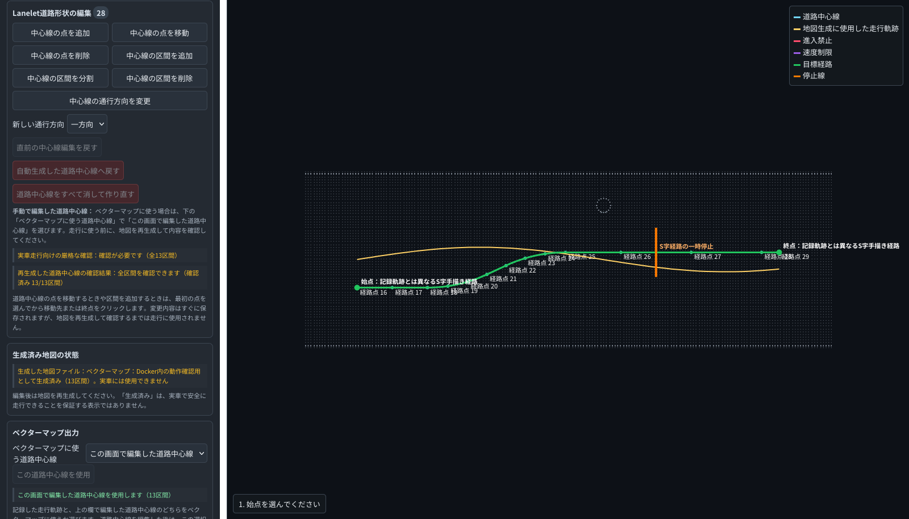
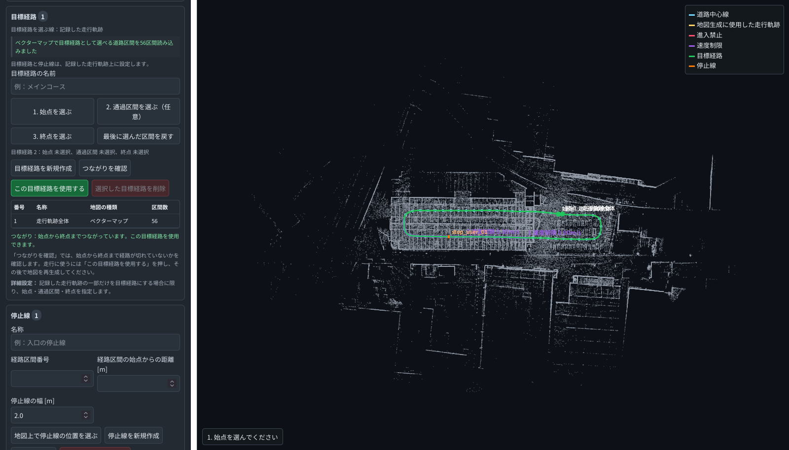
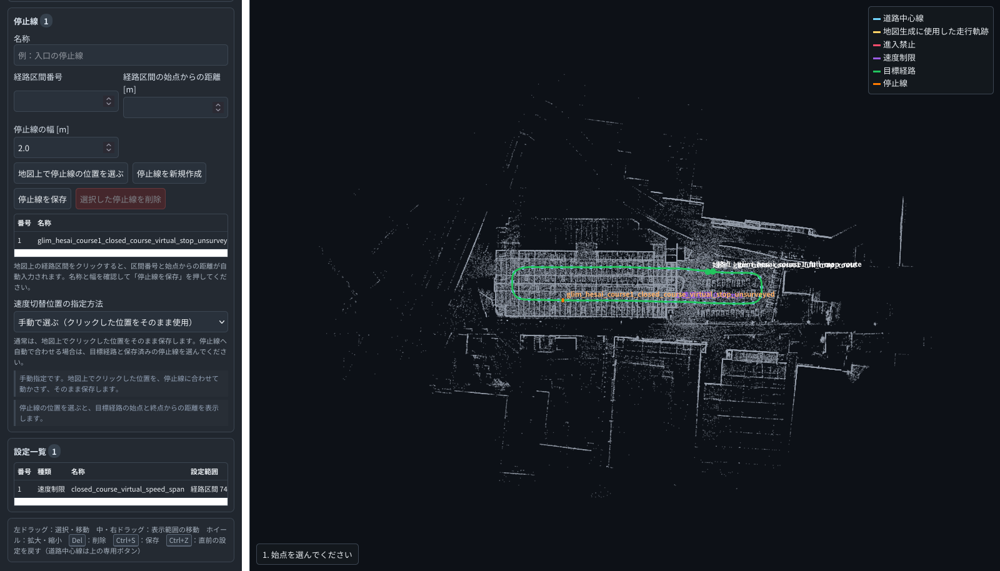
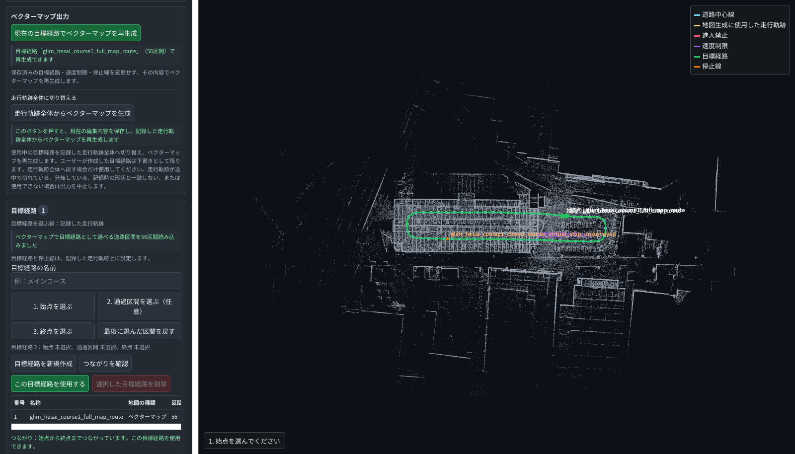

# LiDAR Mobility Map Generator 地図作成・編集 操作マニュアル

[English](operator_manual.md) | **日本語**

このマニュアルでは、取得したデータから地図を作成し、Web GUIとRViz2で
確認・編集するまでを説明します。

- **ベクターマップ（Lanelet2、β版）**：管理された閉鎖コースでAutoware®を評価するための地図
- **ナビゲーションマップ（α版）**：Nav2で読み込む2D占有格子地図と経路

本書は、2026年9月5日付の初回公開版v0.11.0を対象とします。

入力には、LiDAR SLAMで作成した点群地図と自己位置軌跡、またはrosbag2に記録した
点群と自己位置推定結果を使用します。LiDAR SLAM入力は、
[GLIM](https://github.com/koide3/glim)が出力した点群地図と軌跡を使って地図を
生成できることを確認しています。本ツールにはSLAMや自己位置推定機能は含まれていません。


## 1. 事前に用意するもの

### 1.1 動作環境

- Ubuntu 24.04
- ROS™ 2 Jazzy
- RViz2を表示できるデスクトップ環境
- ベクターマップをAutowareで確認する場合は、Docker Engineと、Dockerで起動できる
  Autoware環境
- Autowareで使用する車両モデルとセンサーモデル
- ナビゲーションマップの読み込み試験を行う場合は、DockerとNav2イメージ

最初にパッケージをビルドします。

```bash
export LMMG_WORKSPACE="$HOME/lmmg_ws"
mkdir -p "$LMMG_WORKSPACE/src"
# 本リポジトリを次の場所に配置します。
# $LMMG_WORKSPACE/src/lidar_mobility_map_generator

source /opt/ros/jazzy/setup.bash
cd "$LMMG_WORKSPACE"
rosdep install --from-paths src --ignore-src -r -y
colcon build --symlink-install \
  --packages-select lidar_mobility_map_generator
source "$LMMG_WORKSPACE/install/setup.bash"
```

新しいターミナルを開いたときは、次を実行してから作業します。環境変数は新しい
ターミナルへ引き継がれないため、後の章で設定する`LMMG_PROJECT`、`LMMG_CONFIG`、
`LMMG_VEHICLE`、出力先なども、そのターミナルで改めて設定してください。

```bash
export LMMG_WORKSPACE="$HOME/lmmg_ws"
source /opt/ros/jazzy/setup.bash
source "$LMMG_WORKSPACE/install/setup.bash"
```

### 1.2 入力データ

次のどちらかを用意します。

#### LiDAR SLAMの処理結果

- 点群地図：PLYまたはPCD
- 自己位置軌跡：TUM形式

GLIMの場合は、点群地図と`traj_lidar.txt`を使用できます。ほかのLiDAR SLAMを使う
場合は、点群と軌跡を上記の形式に変換してください。この入力方法は、設定ファイルで
`input.type: glim`および`input.glim.*`と表します。

#### rosbag2

- `sensor_msgs/msg/PointCloud2`の点群
- `nav_msgs/msg/Odometry`、`geometry_msgs/msg/PoseStamped`、
  `nav_msgs/msg/Path`、またはTFによる自己位置推定結果
- 必要な`/tf`と`/tf_static`

点群だけのbagから走行軌跡を推定する機能はありません。地図作成に使う正しい自己位置推定結果が、
事前にbagへ記録されていることを確認してください。

Hesai、Velodyne、Livox MID-360で収録したrosbag2については、
[gicp_gnss_odom_localizer](https://github.com/KariControl/gicp_gnss_odom_localizer)による
自己位置推定結果を入力して地図を生成できることを確認しています。
Velodyneデータから作成したGLIM出力についても、ベクターマップを生成できることを
確認しています。取得場所を保護するため、Velodyneの実データに由来する画像は
公開しません。

### 1.3 座標系とLiDARの取付位置・姿勢

軌跡が表す基準点を、入力の種類に応じた設定で指定します。

- LiDAR SLAM入力：`input.glim.trajectory_frame: sensor`または`base`
- rosbag2入力：`input.rosbag2.pose_reference_frame: sensor`または`base`

`sensor`は軌跡がLiDAR原点を、`base`は車体またはロボットの基準点を表します。
`sensor`を選ぶ場合は、`T_base_sensor`（車体基準座標系から見たLiDARの位置・姿勢）が
必要です。LiDAR SLAM入力では`extrinsics.source: parameters`にして、並進を
`extrinsics.translation`、回転を`extrinsics.quaternion_xyzw`へ指定します。
rosbag2入力では、bag内に必要な変換がある場合は`extrinsics.source: tf_static`を、
設定ファイルから与える場合は`extrinsics.source: parameters`と上記2項目を使用します。

実車・実機用には、実際に測定した値を使用してください。測定結果を確認済みとして
扱う場合は、値に加えて次の3項目を設定します。

```yaml
extrinsics.calibration_source: measured
extrinsics.calibration_confidence: high
extrinsics.verified: true
```

推定値や初期値のまま`extrinsics.verified: true`にしてはいけません。

### 1.4 車体・ロボットの寸法

ベクターマップは、実際に走行させる車両の寸法を使って生成します。Autowareで使う
`vehicle_info.param.yaml`を作業用プロジェクトの`config`ディレクトリへコピーし、次の
全項目を実測値へ置き換えます。ファイル本体と、その保存先までのパスには
シンボリックリンクを使用できません。

```yaml
/**:
  ros__parameters:
    wheel_radius: 0.0
    wheel_width: 0.0
    wheel_base: 0.0
    wheel_tread: 0.0
    front_overhang: 0.0
    rear_overhang: 0.0
    left_overhang: 0.0
    right_overhang: 0.0
    vehicle_height: 0.0
    max_steer_angle: 0.0
```

`max_steer_angle`の単位はラジアンです。データを収録した車両と、地図を使って
走行させる車両の寸法が異なる場合は、地図生成に失敗する可能性があります。

#### Laneletの左右マージンの設定

ベクターマップにおける走路境界を決めるためのパラメータを設定します。ベクターマップで
使用する車体寸法は`vehicle_info.param.yaml`から読み込みます。一方、車体外側から
Lanelet境界までの余裕は、地図生成用の設定ファイルへ
`robot.clearance_margin`として指定します。

```yaml
lidar_mobility_map_generator:
  ros__parameters:
    robot.clearance_margin: 0.30  # 車体の片側に30 cmの余裕を設定
```

`robot.clearance_margin`は**片側の値**です。横方向の制御誤差、自己位置推定誤差、
点群地図との位置合わせ誤差、車体寸法の誤差、車体の揺れ、および障害物との間に必要な
物理的余裕を考慮して決めます。設定値は、少なくとも次の合計以上にします。各項目には、
平均値ではなく、対象車両と使用条件で確認した最大値を使用してください。

```text
robot.clearance_margin
  ≧ 最大横方向制御誤差
   + 最大自己位置推定・地図位置合わせ誤差
   + 車幅測定誤差・車体の横揺れ
   + 障害物との間に必要な離隔
```

直線部に生成されるLanelet幅の目安は、次の式で確認できます。

```text
車幅 + 2 × (robot.clearance_margin + 0.05 m)
```

最後の0.05 mは、離散的に計算した境界点を補間した境界線が車体領域に食い込むことを防ぐための
内部ガードです。カーブでは、前端・後端が旋回時に通る範囲も含めて左右境界を広げるため、
上の式より広くなる場合があります。

例えば、車幅1.695 m、`robot.clearance_margin: 0.30`の場合、直線部のLanelet幅は
約2.395 mが目安になります。

```text
1.695 + 2 × (0.30 + 0.05) = 2.395 m
```

値を大きくすると、再生成時に確認する車体周囲の範囲も広がります。その範囲が障害物や
未確認領域と重なる場合は、Laneletを無条件には広げず、静的検証を不合格とします。
判定を通すために余裕を小さくせず、入力点群、走行する中心線、または実際の通路を
見直してください。

生成後は`autoware_candidate_acceptance.json`の次の項目を確認します。

| 項目 | 確認内容 |
|---|---|
| `metrics.estimated_vehicle_width_m` | 地図生成に使用した車幅 |
| `metrics.estimated_lateral_margin_m` | 設定した片側の余裕 |
| `metrics.estimated_boundary_interpolation_guard_m` | 境界補間用の内部ガード |
| `metrics.minimum_lanelet_width_m` | 生成されたLaneletの最小幅 |

ロボット用のナビゲーションマップでは、設定ファイルの`robot.*`へロボット幅、前後長、必要な
余裕、旋回方式を指定します。その場旋回が可能なロボットは
`robot.allow_in_place_rotation: true`にします。自動車型車両では
`robot.allow_in_place_rotation: false`とし、`robot.minimum_turning_radius`へ0より大きい
最小旋回半径を指定します。

実測した車体・ロボット寸法を確認済みとして扱う場合は、設定ファイルへ次も記載します。

```yaml
robot.dimensions_source: measured
robot.dimensions_confidence: high
robot.dimensions_verified: true
```

`robot.dimensions_verified: true`を使用するには、前節の`extrinsics.verified: true`も
必要です。車体寸法だけを確認済みにして、LiDARの取付位置・姿勢を未確認のままにすることは
できません。

## 2. 作業用ディレクトリと設定ファイル

作業用ディレクトリと設定ファイルを作成します。まずは次のコマンドでディレクトリを
生成します。

```bash
export LMMG_PROJECT="$HOME/lmmg_project"
export LMMG_PACKAGE_SHARE="$(ros2 pkg prefix --share lidar_mobility_map_generator)"

mkdir -p \
  "$LMMG_PROJECT/input" \
  "$LMMG_PROJECT/config" \
  "$LMMG_PROJECT/output"
```

LiDAR SLAMの処理結果を使う場合は、ひな形をコピーします。

```bash
cp "$LMMG_PACKAGE_SHARE/config/glim.yaml" \
  "$LMMG_PROJECT/config/site_glim.yaml"
```

rosbag2を使う場合は、こちらをコピーします。

```bash
cp "$LMMG_PACKAGE_SHARE/config/rosbag2.yaml" \
  "$LMMG_PROJECT/config/site_rosbag2.yaml"
```

コピーしたYAMLで、入力ファイル、トピック、座標系、LiDARの取付位置・姿勢、
車体・ロボット寸法を設定します。サンプル内の`/data/...`は例示用なので、必ず実際の
入力データのパスへ書き換えます。

地図の種類は`output.target_mode`で選びます。

| 設定値 | 作成する地図 |
|---|---|
| `vector_map` | Lanelet2ベクターマップ |
| `navigation_map` | Nav2向けナビゲーションマップ |
| `both` | 同じ車体基準点、外形寸法、旋回方式を両方の地図で共有できる場合だけ使用 |

このマニュアルでは、ベクターマップとナビゲーションマップを別々の出力ディレクトリへ
生成します。3章と6章のコマンドは、`output.target_mode`を各地図の値で上書きします。

## 3. ベクターマップを作成する

### 3.1 初回生成

設定ファイル、車両情報、出力先を指定してベクターマップを生成します。次の例では、
LiDAR SLAM用の設定ファイルを使用します。

```bash
export LMMG_CONFIG="$LMMG_PROJECT/config/site_glim.yaml"
export LMMG_VEHICLE="$LMMG_PROJECT/config/vehicle_info.param.yaml"
export LMMG_VECTOR_OUTPUT="$LMMG_PROJECT/output/vector_map"

# 既定値です。データ収録車両と走行対象車両が同一であることを未確認として記録します。
export LMMG_ACQUISITION_VEHICLE_IS_TARGET=false

ros2 run lidar_mobility_map_generator run_vector_map_workflow.sh \
  generate \
  "$LMMG_CONFIG" \
  "$LMMG_VEHICLE" \
  "$LMMG_VECTOR_OUTPUT"
```

`LMMG_ACQUISITION_VEHICLE_IS_TARGET`は、データ収録車両と、地図を使って走行させる
対象車両が同一かどうかを記録します。既定値は`false`です。`false`のままでも地図は
生成できますが、その出力を使った走行試験は開始しないでください。

車両管理記録などにより、両者が同一の車両であることを確認できた場合に限り、生成前に
次のように設定します。寸法が同じ別車両であるという理由だけで`true`にしてはいけません。

```bash
export LMMG_ACQUISITION_VEHICLE_IS_TARGET=true
```

rosbag2を使う場合は、`LMMG_CONFIG`をrosbag2用の設定ファイルへ変更します。LiDAR SLAMと
rosbag2の結果を比較する場合は、それぞれ別の出力ディレクトリを指定します。

生成が完了すると、ターミナルに次のメッセージが表示され、コマンド入力待ちへ戻ります。

```text
LiDAR Mobility Map Generator: Vector Map output is ready under ...
```

エラーが表示された場合は、その出力を使用しません。入力データまたは設定を修正し、
同じ`generate`コマンドでもう一度生成します。

### 3.2 GUIとRViz2で確認する

次のコマンドで、Web GUIとRViz2を開きます。

```bash
ros2 run lidar_mobility_map_generator run_vector_map_workflow.sh \
  review \
  "$LMMG_CONFIG" \
  "$LMMG_VEHICLE" \
  "$LMMG_VECTOR_OUTPUT"
```

ブラウザーが自動で開かない場合は、ターミナルに表示されたlocalhostのURLを開きます。
`review`の実行中は、そのターミナルで編集サーバーが動作します。ほかのコマンドを
実行するときは新しいターミナルを開き、1.1、2、3.1節の環境変数を設定し直します。


GUIとRViz2で次を確認します。

1. 画面上部に「Vector Map Beta（ベクターマップ β版）」と表示されていることを
   確認します。
2. 「表示項目」で「入力された走行軌跡」を有効にします。このレイヤーと
   「地図生成に使用した走行軌跡」の範囲が一致していることを確認します。
3. 点群、地図生成に使用した走行軌跡、道路中心線の位置が重なっていることを確認します。
4. Laneletの左右境界が反転または交差しておらず、途中で切れていないことを確認します。
5. RViz2でも、点群、軌跡、Lanelet2が`map`座標系で同じ位置に表示されることを
   確認します。

地図は中ボタンまたは右ボタンのドラッグで移動し、ホイールで拡大・縮小します。
項目を選択するときは左ボタンを使います。

位置ずれや境界の異常がある場合は編集を始めず、`Ctrl+C`で終了します。入力データ、
座標系、LiDARの取付位置・姿勢を確認し、3.1節からやり直します。確認だけで終了する場合も、
`Ctrl+C`を押して編集サーバーとRViz2を終了します。

## 4. ベクターマップを編集する

### 4.1 保存と再生成の違い

GUIで保存した編集内容は、ベクターマップを再生成するまでLanelet2出力へ反映されません。
操作ごとの保存対象は次のとおりです。

| 操作 | 保存する内容 | Lanelet2へ反映する時期 |
|---|---|---|
| 道路中心線の編集ツール | 中心線の点と区間（操作ごとに自動保存） | 再生成後 |
| 「速度制限などを保存」 | 速度制限、進入禁止、位置注記など | 再生成後 |
| 「この目標経路を使用する」 | 使用する目標経路1件 | 再生成後 |
| 「停止線を保存」 | 目標経路上の停止線 | 再生成後 |
| 「この道路中心線を使用」 | 記録した走行軌跡またはGUIで編集した中心線 | 再生成後 |
| ベクターマップの再生成ボタン | 保存済みの内容を使ったLanelet2出力 | 完了メッセージ表示後 |

保存操作の後は、画面に保存完了のメッセージが表示されたことを確認します。未保存の
項目がある状態では再生成を開始しません。

GUIの「目標経路」は、生成と静的検証に使用する中心線上の接続順と範囲を記録するものです。
AutowareのPlanning Simulatorへ始点と目標地点を送る機能ではありません。Autoware側の
目標地点は5.2節で別に設定します。

### 4.2 隣り合う速度区間を作る

ここでは、0.90 m/sの区間に0.30 m/sの区間を隙間なく接続します。

1. 「速度制限（区間指定）」を押します。
2. 「速度 [m/s]」に`0.90`を入力します。
3. 1区間目の始点と終点を、走行方向に沿って選択します。速度は終点を選ぶ前に
   入力します。
4. 作成した0.90 m/sの区間を選択し、「選択した項目に反映」を押します。
5. 同じ区間を選択したまま、「この終点から次の速度区間を追加」を押します。
6. 「速度 [m/s]」に`0.30`を入力し、2区間目の終点だけを選択します。
7. 作成した0.30 m/sの区間を選択し、「選択した項目に反映」を押します。
8. 「二つの速度設定の間に、地図全体の既定速度が入る区間はありません」と表示される
   ことを確認します。
9. 「速度制限などを保存」を押します。

二つの速度区間を別々に新規作成すると、境界に小さな隙間が残ることがあります。隣接する
速度区間には「この終点から次の速度区間を追加」を使います。画面下部に0.5 m以下の隙間、
または異なる速度区間の重複について警告が表示された場合は、該当区間を修正して
保存し直します。

すべての編集が終わったら、現在の目標経路でベクターマップを再生成します。

### 4.3 記録した走行軌跡全体から再生成する

記録した走行軌跡全体を道路中心線と目標経路にする場合は、次の手順で再生成します。

1. 「ベクターマップに使う道路中心線」で「記録した走行軌跡」を選択します。
2. 「この道路中心線を使用」を押します。
3. 「走行軌跡全体からベクターマップを生成」を押します。
4. 「ベクターマップの再生成を開始しました」と表示されたら、GUIを操作せずに待ちます。
5. 編集サーバーの終了後、起動元のターミナルで再生成が続きます。ブラウザーのタブが
   残っていても操作しません。
6. ターミナルに完了メッセージが表示され、コマンド入力待ちへ戻ったことを確認します。
7. 残っているブラウザーのタブを閉じ、3.2節の`review`コマンドで開き直します。
8. 「ベクターマップ出力」欄に、目標経路「走行軌跡全体」で再生成できることが
   表示されていることを確認します。

この操作は、記録した走行軌跡の短縮版を自動的に作りません。軌跡が途中で切れている、
分岐している、記録時の形状と一致しない、または生成に使用できない場合は処理が停止します。
エラーが表示された場合は再生成前のブラウザー画面を閉じ、出力を使用しません。

### 4.4 道路中心線を手動で編集する

GUIでは、点群を背景にLaneletの中心線を描きます。左右境界を1本ずつ描く必要はありません。
再生成時に、対象車両の幅、前端・後端までの長さ、`robot.clearance_margin`を使って
左右境界を生成します。点群から道路中心線を自動抽出する機能ではありません。

道路中心線と目標経路の役割は異なります。

| 項目 | 役割 |
|---|---|
| 道路中心線 | Laneletを生成する道路形状を定義します |
| 目標経路 | 道路中心線上で、生成と静的検証に使う接続順と範囲を指定します |

目標経路に道路中心線の一部だけを選んでも、静的検証に合格したほかのLaneletは
ベクターマップに残ります。また、目標経路はAutowareのMissionとして自動再生されません。

編集画面では分岐を作成し、目標経路の操作でその中から1本の経路を選択できます。
ただし、v0.11.0の車体外形による静的検証は、Lanelet構成に分岐が1つでも残っていると
不合格になります。再生成前に使用しない分岐をすべて削除してください。公開版で評価用として
扱えるのは、始点から終点まで接続された、一方向かつ分岐のない1本の経路だけです。
分岐、交差、ループ、双方向交通を含む道路網の検証は対象外です。

#### 道路中心線を作る

1. 既存の中心線を修正する場合は、そのまま編集を始めます。自動生成時の状態へ戻す場合は
   「自動生成した道路中心線へ戻す」を押します。空の状態から描き直す場合は
   「道路中心線をすべて消して作り直す」を押します。
2. 「中心線の点を追加」を押し、区間の端点にする位置を順に選択します。
3. 「中心線の区間を追加」を押し、始点と終点を順に選択します。曲線にする場合は、
   始点を選択した後、`Shift`キーを押しながら中間点を選択し、最後に終点を選択します。
4. 必要に応じて「中心線の点を移動」「中心線の点を削除」「中心線の区間を分割」
   「中心線の区間を削除」を使います。進行方向が逆の場合は
   「中心線の通行方向を変更」で修正します。
5. 「ベクターマップに使う道路中心線」で「この画面で編集した道路中心線」を選択し、
   「この道路中心線を使用」を押します。
6. 道路中心線をさらに編集した場合は、「この道路中心線を使用」をもう一度押します。
   保存済みの目標経路と停止線も、現在の道路中心線に対して確認し直します。

クリックした位置の高さは、近くの既存経路、入力軌跡、または点群から自動設定されます。
高さを求められない位置には点を追加できません。道路中心線の変更は操作ごとに自動保存されますが、
Lanelet2へ反映するには再生成が必要です。



上の画像では、黄色が地図生成に使用した走行軌跡、緑色がGUIで編集した道路中心線、
オレンジ色が停止線です。画像は編集操作の例であり、実環境での安全性やAutowareでの
走行結果を示すものではありません。

再生成時には、手動編集した各区間の車体外形と最小旋回半径を確認し、障害物や
未確認領域との重なりを静的に検証します。入力点群で確認できない場所を走行可能な道路として
扱ってはいけません。静的検証を通す目的で、障害物判定、車両寸法、LiDARの取付位置・姿勢を
実態と異なる値へ変更しないでください。検証に合格しない場合は、道路中心線または
入力データを見直します。

#### 目標経路を設定する

道路中心線全体を使う場合は、「編集した道路中心線全体から生成」を押します。組み込みの
目標経路「編集した道路中心線全体」が選択されます。再生成が始まった後は、4.3節と同様に
ターミナルの完了メッセージを待ち、`review`コマンドで開き直します。

道路中心線の一部を目標経路にする場合は、次の手順で設定します。使用する目標経路として
登録できるのは1件だけです。別の目標経路がすでに使用中の場合は、その経路を一覧で選択し、
「選択した目標経路を削除」で削除してから作成します。



1. 「目標経路を新規作成」を押します。
2. 「目標経路の名前」を入力します。
3. 「1. 始点を選ぶ」を押し、表示されている経路点から始点を選択します。
   線の途中は始点として選択できません。
4. 分岐などで経路が一意に決まらない場合や、通過順を明示する場合は、
   「2. 通過区間を選ぶ（任意）」で通過区間を順番に選択します。この操作は編集中の
   経路確認には使えますが、v0.11.0の静的検証に合格するには、使用しない分岐を道路中心線から
   すべて削除する必要があります。
5. 「3. 終点を選ぶ」を押し、表示されている経路点から終点を選択します。
   線の途中は終点として選択できません。
6. 「つながりを確認」を押し、始点から終点まで経路がつながっていることを確認します。
7. 「この目標経路を使用する」を押します。
8. 「現在の目標経路でベクターマップを再生成」を押します。
9. ターミナルの完了メッセージを待ち、`review`コマンドで開き直します。
10. 「ベクターマップ出力」欄に、選択した目標経路名が表示されていることを確認します。

「目標経路」は道路形状を変更しません。道路形状は、GUIの
「Lanelet道路形状の編集」欄で変更します。経路がつながらない場合や静的検証に
合格しない区間がある場合は、出力を使用せず、道路中心線または入力データを見直します。

### 4.5 停止線を追加する

目標経路上の停止位置を、GUIの「停止線」欄で指定します。



1. 使用する目標経路を一覧で選択し、「この目標経路を使用する」を押します。
2. 「停止線を新規作成」を押します。
3. 名称を入力し、「停止線の幅 [m]」に0より大きい値を入力します。
4. 「地図上で停止線の位置を選ぶ」を押し、目標経路上の位置を選択します。
5. 表示された経路区間番号、始点からの距離、終点までの距離を確認します。
   Planning Simulatorで走行試験を行う場合は、始点と終点の両方から10 m以上離れた
   位置を選択します。
6. 「停止線を保存」を押します。
7. 「現在の目標経路でベクターマップを再生成」を押します。
8. ターミナルの完了メッセージを待ち、`review`コマンドで開き直します。

「速度切替位置の指定方法」にある「停止線の位置へ自動調整（詳細設定）」は、速度区間の
境界を停止線へ合わせる機能です。この操作により、Laneletが区間の途中で分割される場合があります。
停止に必要な減速距離を計算する機能ではありません。減速区間は、対象車両で確認した
停止距離とAutowareの制御特性に基づいて別途設定し、走行試験で確認します。

### 4.6 再生成ボタンが押せない場合



ボタンの近くに表示される理由を確認し、次の項目を上から順に確認します。

- 「現在の目標経路でベクターマップを再生成」は、目標経路を1件選択し、
  「この目標経路を使用する」を押した後に有効になります。
- 道路中心線を編集した場合は、使用する中心線を選択し、
  「この道路中心線を使用」を押し直します。
- 中心線全体から生成する場合は、途中で切れた区間、分岐、ループがないことを確認します。
- 編集中の区間や範囲は完了または取り消します。速度制限など、目標経路、停止線に
  未保存の変更がある場合は、それぞれの保存ボタンを押します。
- 再生成ボタンを使うには、3.2節の`run_vector_map_workflow.sh review`でGUIを開きます。
- 入力データ、設定ファイル、車両情報を生成後に変更した場合は、3.1節の`generate`から
  やり直します。
- 「地図を再生成してください」または元データが古いという表示が出た場合は、
  GUIを閉じて再生成し、開き直します。

解決しない場合は、GUIを起動したターミナルで、失敗の原因を示す最初のエラーを確認します。
エラーを消す目的で車両寸法や道路形状を根拠なく変更してはいけません。

## 5. ベクターマップ出力を確認する

### 5.1 出力ファイルと静的検証

主な出力は次のとおりです。

| ファイル／ディレクトリ | 内容 |
|---|---|
| `lanelet2_map_closed_course_experimental.osm` | 生成したLanelet2ベクターマップ |
| `autoware_closed_course_experimental_map/` | Autowareで読み込む地図一式 |
| `target_vehicle_info.param.yaml` | 地図生成に使用した車両情報のコピー |
| `autoware_candidate_acceptance.json` | 選択した中心線とLanelet2の静的検証結果 |
| `route_body_passage_planning_report.json` | 記録軌跡候補に対する車体外形の通過検証結果 |
| `target_vehicle_map_binding.json` | 車両情報とLanelet2内の車両属性の対応結果 |
| `acquisition_vehicle_target_contract.json` | 入力、設定、車両情報、車両同一性の生成時記録 |
| `acquisition_vehicle_target_contract.sha256` | 生成時記録のSHA-256 |


上の画像は本ツールのRViz2レビュー表示です。Autowareの走行画面ではありません。

`autoware_candidate_acceptance.json`は、例えば次のように確認します。

```bash
python3 - "$LMMG_VECTOR_OUTPUT/autoware_candidate_acceptance.json" <<'PY'
import json
import sys

with open(sys.argv[1], encoding="utf-8") as stream:
    report = json.load(stream)

if (
    not isinstance(report, dict)
    or report.get("format_version") != 1
    or report.get("acceptance_scope") != "static_format_geometry_coverage_only"
):
    raise SystemExit("静的検証レポートの形式または検証範囲が一致しません")

source = report.get("centerline_source")
if source not in ("recorded_trajectory", "edited_topology"):
    raise SystemExit("ベクターマップに使った道路中心線を確認できません")

if not (
    report.get("accepted") is True
    and report.get("errors") == []
    and report.get("counts", {}).get("synthetic_planning_support_lanelets") == 0
    and report.get("planning_support", {}).get("present") is False
):
    raise SystemExit("静的検証に合格していません")

warnings = report.get("warnings")
if not isinstance(warnings, list):
    raise SystemExit("警告一覧を確認できません")

print("静的検証：合格")
print("道路中心線の生成元：", source)
print("検証範囲：", report.get("coverage_reference"))
print("警告件数：", len(warnings))
for warning in warnings:
    print("警告：", warning)
PY
```

`centerline_source`が`recorded_trajectory`なら記録した走行軌跡、
`edited_topology`ならGUIで編集した道路中心線を使用しています。警告がある場合は、
内容と対象区間を確認し、解消するか、後の評価で確認すべき項目として記録します。
原因を確認できない警告が残る出力では、走行試験を開始しません。

始点より手前や終点より先に、走行可能なLanelet中心線を自動追加することはありません。
車体の前端と後端を地図内へ収めるため、左右境界は中心線の始終端より前後へ延びる場合が
ありますが、中心線や目標経路の延長ではありません。

`accepted: true`は静的検証に合格したことだけを示します。Autowareで経路を計画できること、
Planning Simulatorで走行できること、実車・実ロボットで安全に使用できることは示しません。

### 5.2 Docker版Autowareで走行を確認する

この節では、Autoware公式のDockerイメージでPlanning Simulatorを起動します。本ツールに
Autoware本体、Dockerイメージ、車両モデル、センサーモデルは含まれません。
最初に、[AutowareのDocker導入手順](https://docs.autoware.org/main/installation/autoware/docker-installation/)
に従って、使用するAutowareのイメージを取得します。再現できるように、タグだけではなく
イメージのダイジェストを記録します。

この節で動かすのはPlanning Simulator内の模擬車両です。実車の車両インターフェースを
起動する手順ではありません。使用するAutowareのバージョン、Dockerイメージのダイジェスト、
車両モデル、センサーモデルを作業記録に残します。

#### 生成時の契約を確認する

走行試験の前に、生成時の入力、設定、車両情報が変わっていないことと、データ収録車両と
走行対象車両が同一であることを確認します。次のコマンドは入力ファイルのハッシュも
確認するため、完了まで時間がかかる場合があります。新しいターミナルで実行します。

```bash
set -o pipefail

export LMMG_WORKSPACE="$HOME/lmmg_ws"
source /opt/ros/jazzy/setup.bash
source "$LMMG_WORKSPACE/install/setup.bash"

export LMMG_PROJECT="$HOME/lmmg_project"
export LMMG_CONFIG="$LMMG_PROJECT/config/site_glim.yaml"
export LMMG_VECTOR_OUTPUT="$LMMG_PROJECT/output/vector_map"
export LMMG_REPOSITORY="$LMMG_WORKSPACE/src/lidar_mobility_map_generator"
export LMMG_DATASET="${LMMG_VECTOR_OUTPUT##*/}"

python3 "$LMMG_REPOSITORY/scripts/generation_calibration_contract.py" \
  verify-direct \
  --expected-dataset "$LMMG_DATASET" \
  --expected-map-type vector_map \
  --contract "$LMMG_VECTOR_OUTPUT/acquisition_vehicle_target_contract.json" \
  --sha256 "$LMMG_VECTOR_OUTPUT/acquisition_vehicle_target_contract.sha256" \
  --generator-parameters "$LMMG_CONFIG" \
  --target-vehicle-info "$LMMG_VECTOR_OUTPUT/target_vehicle_info.param.yaml" \
  --verify-inputs \
  --format tsv |
  awk -F '\t' '
    $1 == "ACQUISITION_VEHICLE_IS_TARGET" && $2 == "true" { confirmed = 1 }
    END {
      if (!confirmed) {
        print "データ収録車両と走行対象車両の同一性を確認できません" > "/dev/stderr"
        exit 1
      }
      print "生成時の契約：確認済み"
    }
  '
```

コマンドが失敗した場合や、`LMMG_ACQUISITION_VEHICLE_IS_TARGET=false`で生成した場合は、
走行試験を開始しません。設定を`true`へ書き換えるだけでは既存出力の契約は変わりません。
3.1節の条件を満たす場合だけ、`true`を設定して地図を生成し直します。

#### 地図と車両モデルを確認する

同じターミナルで次を実行します。`AUTOWARE_IMAGE`には、ローカルに取得済みの
Autoware Universeイメージを`@sha256:...`形式で指定します。
`AUTOWARE_VEHICLE_MODEL`と`AUTOWARE_SENSOR_MODEL`は、使用するAutoware環境に合わせて
変更します。

```bash
export AUTOWARE_DATA="$HOME/autoware_data"
export AUTOWARE_IMAGE="ghcr.io/autowarefoundation/autoware:universe-jazzy@sha256:<64桁の16進数>"

# Autowareの標準イメージに含まれるモデル名です。
export AUTOWARE_VEHICLE_MODEL="sample_vehicle"
export AUTOWARE_SENSOR_MODEL="sample_sensor_kit"

export LMMG_AUTOWARE_MAP="$LMMG_VECTOR_OUTPUT/autoware_closed_course_experimental_map"
export LMMG_AUTOWARE_MAP="$(realpath "$LMMG_AUTOWARE_MAP")"

docker image inspect "$AUTOWARE_IMAGE" >/dev/null || {
  echo "AutowareのDockerイメージがローカルにありません" >&2
  exit 1
}
test -d "$AUTOWARE_DATA/ml_models" || {
  echo "AutowareのMLモデルが見つかりません：$AUTOWARE_DATA/ml_models" >&2
  exit 1
}
for FILE in lanelet2_map.osm pointcloud_map.pcd map_projector_info.yaml
do
  test -f "$LMMG_AUTOWARE_MAP/$FILE" || {
    echo "地図ファイルがありません：$LMMG_AUTOWARE_MAP/$FILE" >&2
    exit 1
  }
done
```

`AUTOWARE_VEHICLE_MODEL`は、AutowareへROS 2パッケージとして組み込まれた車両モデル名です。
`vehicle_info.param.yaml`のファイルパスではありません。上の`sample_vehicle`と
`sample_sensor_kit`は、Autowareの標準モデルを使う例です。別のモデルを使う場合は、
`${AUTOWARE_VEHICLE_MODEL}_description`と
`${AUTOWARE_SENSOR_MODEL}_description`の両パッケージを含むAutowareイメージを用意し、
そのイメージをダイジェストで固定します。

次のコマンドで両パッケージを確認し、Autowareが使う`vehicle_info.param.yaml`を
コンテナーから取り出します。その後、地図生成時に保存した
`target_vehicle_info.param.yaml`と、唯一の`ros__parameters`マッピング全体を比較します。

```bash
(
  set -euo pipefail
  LMMG_AUTOWARE_PREFLIGHT="$(mktemp -d)"
  trap 'rm -rf -- "$LMMG_AUTOWARE_PREFLIGHT"' EXIT

  docker run --rm --pull never \
    --network none \
    -e HOST_UID="$(id -u)" \
    -e HOST_GID="$(id -g)" \
    -e AUTOWARE_VEHICLE_MODEL="$AUTOWARE_VEHICLE_MODEL" \
    -e AUTOWARE_SENSOR_MODEL="$AUTOWARE_SENSOR_MODEL" \
    -v "$LMMG_AUTOWARE_PREFLIGHT:/lmmg_preflight:rw" \
    "$AUTOWARE_IMAGE" \
    bash -lc '
      set -euo pipefail
      source /opt/autoware/setup.bash
      vehicle_package="${AUTOWARE_VEHICLE_MODEL}_description"
      sensor_package="${AUTOWARE_SENSOR_MODEL}_description"
      vehicle_share="$(ros2 pkg prefix --share "$vehicle_package")"
      sensor_share="$(ros2 pkg prefix --share "$sensor_package")"
      test -d "$vehicle_share"
      test -d "$sensor_share"
      vehicle_info="$vehicle_share/config/vehicle_info.param.yaml"
      test -f "$vehicle_info"
      cp -- "$vehicle_info" /lmmg_preflight/autoware_vehicle_info.param.yaml
      printf "車両description：%s\n" "$vehicle_share"
      printf "センサーdescription：%s\n" "$sensor_share"
      printf "Autoware車両情報：%s\n" "$vehicle_info"
    '

  python3 - \
    "$LMMG_VECTOR_OUTPUT/target_vehicle_info.param.yaml" \
    "$LMMG_AUTOWARE_PREFLIGHT/autoware_vehicle_info.param.yaml" <<'PY'
import json
import sys
import yaml


def ros_parameters(path, label):
    with open(path, encoding="utf-8") as stream:
        document = yaml.safe_load(stream)

    blocks = []

    def collect(value):
        if isinstance(value, dict):
            for key, child in value.items():
                if key == "ros__parameters":
                    if not isinstance(child, dict):
                        raise SystemExit(f"{label}のros__parametersがマッピングではありません")
                    blocks.append(child)
                else:
                    collect(child)
        elif isinstance(value, list):
            for child in value:
                collect(child)

    collect(document)
    if len(blocks) != 1:
        raise SystemExit(f"{label}のros__parametersが一意ではありません：{len(blocks)}件")
    return blocks[0]


def canonical(value):
    return json.dumps(
        value,
        ensure_ascii=False,
        sort_keys=True,
        separators=(",", ":"),
        allow_nan=False,
    )


generated = ros_parameters(sys.argv[1], "地図生成時の車両情報")
autoware = ros_parameters(sys.argv[2], "Autowareイメージ内の車両情報")
if canonical(generated) != canonical(autoware):
    raise SystemExit("地図生成時とAutowareの全ros__parametersが一致しません")

print("地図生成時とAutowareの全ros__parameters：一致")
PY
)
```

パッケージの解決または比較に失敗した場合は、Planning Simulatorを起動しません。
標準の`sample_vehicle`が地図生成時の車両情報と一致しない場合は、その名前のまま
走行試験を続けず、対象車両のdescriptionパッケージを含むイメージへ変更します。

#### Planning Simulatorを起動する

同じターミナルで次を実行します。次の例は、NVIDIA GPUを使わないAutoware Universe
イメージ用です。地図とMLモデルは、コンテナーへ読み取り専用で割り当てます。

```bash
xhost +local:docker
docker run --rm -it --pull never \
  --network host \
  -e DISPLAY="$DISPLAY" \
  -e HOST_UID="$(id -u)" \
  -e HOST_GID="$(id -g)" \
  -e QT_X11_NO_MITSHM=1 \
  -v /tmp/.X11-unix:/tmp/.X11-unix:rw \
  -v "$LMMG_AUTOWARE_MAP:/autoware_map:ro" \
  -v "$AUTOWARE_DATA/ml_models:/autoware_data/ml_models:ro" \
  "$AUTOWARE_IMAGE" \
  bash -lc "source /opt/autoware/setup.bash && \
    ros2 launch autoware_launch planning_simulator.launch.xml \
      map_path:=/autoware_map \
      data_path:=/autoware_data/ml_models \
      vehicle_model:=$AUTOWARE_VEHICLE_MODEL \
      sensor_model:=$AUTOWARE_SENSOR_MODEL"
```

NVIDIA GPUを使う場合は、使用するAutowareの版に対応した`universe-cuda`イメージを指定し、
公式のDocker導入手順に従ってGPU関連のオプションを追加します。イメージのROS 2
ディストリビューション、Autowareの版、CUDAの有無を混在させてはいけません。

起動に失敗した場合は、失敗したコンポーネントと、その原因として最初に報告された
エラーを確認します。後続のエラーは、先行する読み込み失敗から発生している場合があります。
RViz2に点群とLaneletが表示され、同じ位置に重なっていることを確認してから次へ進みます。

#### RViz2で始点と目標地点を設定する

1. RViz2上部の「2D Pose Estimate」を押します。使用中のRViz2設定で有効な場合は、
   キーボードの`P`でも選択できます。
2. 目標経路の始点に近いLanelet中心線上で左ボタンを押し、進行方向へドラッグして
   離します。左右境界上やLaneletの外側は選択しません。
3. 車両位置が設定され、車両が点群とLaneletに対して正しい位置と向きで表示されるまで
   待ちます。
4. 「2D Goal Pose」または、使用中のRViz2設定にある同等の目標設定ツールを押します。
5. 目標経路の終点に近いLanelet中心線上で、進行方向へドラッグして離します。
6. Lanelet上に計画経路が表示され、経路計画エラーがないことを確認します。
7. Autoware操作パネルが自動運転へ切り替え可能になったことを確認し、
   「Autonomous」または使用中の版の自動運転開始ボタンを押します。別に
   「Engage」操作が必要な版では、その操作も行います。
8. 模擬車両が動き始め、計画経路を進み、目標地点で停止することを確認します。

本ツールのGUIで保存した目標経路は、Planning Simulatorに自動送信されません。
AutowareのRViz2で始点と目標地点を改めて指定します。

終了するときは、Autowareを起動したターミナルで`Ctrl+C`を押し、コンテナーが
終了するまで待ちます。その後、`xhost -local:docker`を実行してXサーバーへの許可を
取り消します。詳しい操作は、使用している版の
[Autoware Planning Simulation手順](https://docs.autoware.org/main/demos/planning-sim/)
を確認してください。

#### 結果を記録する

地図評価中に制御パラメータを都度変更せず、次を別々に記録します。

- 入力データ、LiDAR Mobility Map Generatorの版、地図ファイルのハッシュ
- Autowareの版とDockerイメージのダイジェスト
- 車両モデル、センサーモデル、固定したPlanning／Control設定
- Lanelet2と点群地図の読み込み結果
- 始点から目標地点までの経路計画結果
- 自動運転状態への移行、走行開始、到着、停止の結果
- 速度制限や停止線を設定した場合は、その静的出力と実行結果

Planning Simulatorの結果は、`autoware_candidate_acceptance.json`の静的検証結果とは
別に判定します。走行できたことを理由に静的検証のエラーを無視したり、制御結果を
合わせるために道路形状を根拠なく変更したりしてはいけません。

## 6. ナビゲーションマップを作成する

### 6.1 生成する

設定ファイルで、入力、座標系、LiDARの取付位置・姿勢、`robot.*`を対象ロボットに
合わせます。

Nav2のロード試験に使う地図には、点群中の地面観測に基づく移動可能領域が必要です。
`traversability.free_space_evidence_mode`は次の意味を持ちます。

| 設定値 | 移動可能領域の根拠 | Nav2ロード試験 |
|---|---|---|
| `trajectory` | 記録した姿勢ごとの軌跡領域 | 対象外 |
| `ground_observations` | 点群中で地面として直接観測されたセル | 候補 |
| `combined` | 軌跡領域と地面観測の両方 | 候補 |

`ground_observations`または`combined`は、入力点群に地面の観測が含まれ、
生成後にGUIとRViz2で移動可能領域を確認できる場合だけ使用します。点が返っていないという
理由だけで、その領域を移動可能として扱ってはいけません。

次のコマンドでは、設定ファイル内の`output.target_mode`と`output.directory`を
ナビゲーションマップ用の値で上書きします。

```bash
export LMMG_NAV_CONFIG="$LMMG_PROJECT/config/site_glim.yaml"
export LMMG_NAV_OUTPUT="$LMMG_PROJECT/output/navigation_map"

ros2 run lidar_mobility_map_generator lidar_mobility_map_generator \
  --ros-args \
  --params-file "$LMMG_NAV_CONFIG" \
  -p output.target_mode:=navigation_map \
  -p "output.directory:=$LMMG_NAV_OUTPUT"
```

rosbag2を使う場合は、`LMMG_NAV_CONFIG`にrosbag2用の設定ファイルを指定します。

生成後は、ロード試験用成果物の判定を確認します。

```bash
python3 - "$LMMG_NAV_OUTPUT/nav2_closed_course_experimental_readiness.yaml" <<'PY'
import sys
import yaml

with open(sys.argv[1], encoding="utf-8") as stream:
    report = yaml.safe_load(stream)

if (
    not isinstance(report, dict)
    or report.get("schema_version") != 2
    or report.get("target") != "nav2_closed_course_experimental"
):
    raise SystemExit("Nav2 readinessファイルの形式または対象が一致しません")

artifact = report.get("artifact")
keys = ("ready", "static_map_ready", "follow_waypoints_ready", "route_server_ready")
if not isinstance(artifact, dict) or any(artifact.get(key) is not True for key in keys):
    raise SystemExit("Nav2ロード試験用の成果物が準備できていません")

print("ロード試験用成果物：準備完了")
print("production_ready：", report.get("production_ready"))
print("deployment.ready：", report.get("deployment", {}).get("ready"))
PY
```

`artifact`欄の4項目は、成果物がロード試験の前提を満たすかどうかを示します。
`production_ready: false`や`deployment.ready: false`は別の判定であり、`artifact`欄が
`true`でも実ロボットで走行できることを示しません。

成果物の判定に失敗した場合は、同じファイルの`map_blockers`、
`follow_waypoints_blockers`、`route_server_blockers`を確認します。入力または設定を
修正して再生成し、判定を通す目的だけで未観測領域を移動可能に変更してはいけません。

### 6.2 GUIとRViz2で確認・編集する

次のコマンドでWeb GUIとRViz2を開きます。

```bash
ros2 launch lidar_mobility_map_generator edit_navigation_map.launch.py \
  "output_directory:=$LMMG_NAV_OUTPUT" \
  frame_id:=map
```

ブラウザーが自動で開かない場合は、ターミナルに表示されたlocalhostのURLを開きます。


目標経路を設定する場合は、次の操作を行います。

1. 「目標経路を新規作成」を押し、「目標経路の名前」を入力します。
2. 「1. 始点を選ぶ」を押し、道路中心線上の始点を選択します。
3. 経路が一意に決まらない場合や通過順を指定する場合は、
   「2. 通過区間を選ぶ（任意）」で通過区間を順番に選択します。
4. 「3. 終点を選ぶ」を押し、終点を選択します。
5. 「つながりを確認」を押し、始点から終点まで経路がつながっていることを確認します。
6. 「この目標経路を使用する」を押します。
7. 目標経路に停止位置を追加する場合は、「停止線」欄で位置を選択し、
   「停止線を保存」を押します。
8. 速度制限、進入禁止、位置注記などを追加した場合は、
   「速度制限などを保存」を押します。

ナビゲーションマップでは、目標経路上に保存した「停止線」をウェイポイントの停止位置として
出力します。編集ツールの「停止位置」で作る点注記とは別の機能です。「停止位置」
「待機位置」「ドッキング位置」「充電位置」「ドア」、速度制限、進入禁止などの注記は
GUIに保存できますが、Nav2の動作に反映できることはこのリリースでは確認していません。

編集後は、GUIを起動したターミナルで`Ctrl+C`を押して終了します。6.1節の生成コマンドを
もう一度実行し、編集内容を出力へ反映します。再生成後はreadinessファイルとGUIを
もう一度確認します。

RViz2では、次の表示を確認します。

- 白：移動可能と判定した領域
- 黒：障害物
- 灰：未確認領域または地図範囲外
- 黄線：地図生成に使用した走行軌跡


目標経路が障害物または未確認領域を横切る場合は出力を使用しません。入力点群、
座標系、LiDARの取付位置・姿勢、ロボット寸法、`traversability.*`の設定を確認し、
地図を作り直します。

### 6.3 Nav2でロード試験を行う

このリリースのロード試験は、次の範囲だけを確認します。

- Map Serverが占有格子地図を読み込み、配信できること
- Route ServerがGeoJSON経路を読み込み、起動できること
- `FollowWaypoints`クライアントの`--dry-run`でウェイポイントYAMLを検証し、要約を
  生成できること

`ComputeRoute`、`FollowWaypoints`アクションの送信、自己位置推定、経路計画、制御、
シミュレーターまたは実ロボットの移動は実行しません。

Dockerイメージの例示用ロックファイルには、意図的に無効なプレースホルダーが入っています。
ロード試験には、少なくとも次を含むNav2 Jazzyイメージを、組織で定めた方法で事前に
ビルドまたは取得します。

- `/opt/ros/jazzy/setup.bash`
- `nav2_map_server`、`nav2_route`、`rclpy`、`lifecycle_msgs`、`nav_msgs`
- `python3`、Pythonパッケージ`PyYAML`、`bash`、`findmnt`

イメージの内容と対象プラットフォームを確認し、タグではなく`@sha256:...`形式の不変な
ダイジェストをロックファイルへ設定します。SHA-256は64桁の小文字16進数で指定し、
全桁が0の値は使用しません。指定した参照がローカルに存在することは、次のコマンドで
確認できます。

```bash
export LMMG_NAV2_ACCEPTANCE_IMAGE="registry.example/lmmg-nav2-jazzy@sha256:<64桁の16進数>"
docker image inspect "$LMMG_NAV2_ACCEPTANCE_IMAGE"
```

ロード試験は`--pull never`で実行されるため、実行中にイメージを取得しません。

試験前に、6.1節の`artifact`欄の4項目がすべて`true`であることを再確認します。

```bash
export LMMG_REPOSITORY="$LMMG_WORKSPACE/src/lidar_mobility_map_generator"
export LMMG_NAV_REPORT="$LMMG_PROJECT/output/nav2_load_report_01"
export LMMG_NAV2_IMAGE_LOCK="$LMMG_PROJECT/config/nav2-load-only-image.lock.env"

(
  set -euo pipefail
  test ! -e "$LMMG_NAV2_IMAGE_LOCK" || {
    echo "新しいロックファイルのパスを指定してください：$LMMG_NAV2_IMAGE_LOCK" >&2
    exit 1
  }
  printf 'LMMG_NAV2_ACCEPTANCE_IMAGE=%s\n' \
    "$LMMG_NAV2_ACCEPTANCE_IMAGE" > "$LMMG_NAV2_IMAGE_LOCK"

  python3 "$LMMG_REPOSITORY/docker/acceptance/scripts/validate_lock.py" \
    "$LMMG_NAV2_IMAGE_LOCK" \
    --mode nav2 \
    --get LMMG_NAV2_ACCEPTANCE_IMAGE

  "$LMMG_REPOSITORY/scripts/run_nav2_load_only_acceptance.sh" \
    "$LMMG_NAV_OUTPUT" \
    "$LMMG_NAV_REPORT" \
    "$LMMG_NAV2_IMAGE_LOCK"
)
```

`LMMG_NAV2_IMAGE_LOCK`と`LMMG_NAV_REPORT`には、どちらもまだ存在しないパスを指定します。
試験をやり直す場合は、ロックファイルとレポートディレクトリの両方を別の名前へ変更します。

試験が完了したら、レポートを確認します。

```bash
python3 - "$LMMG_NAV_REPORT/acceptance.json" <<'PY'
import json
import sys

with open(sys.argv[1], encoding="utf-8") as stream:
    report = json.load(stream)

if (
    not isinstance(report, dict)
    or report.get("schema_version") != 1
    or report.get("kind") != "lmmg_nav2_alpha_load_only_acceptance"
):
    raise SystemExit("Nav2ロード試験レポートの形式または種類が一致しません")

scope = report.get("scope", {})
if report.get("accepted") is not True or report.get("errors") != []:
    raise SystemExit("Nav2ロード試験に合格していません")
if not all(scope.get(key) is True for key in (
    "map_server_load", "route_server_load", "waypoint_yaml_dry_run"
)):
    raise SystemExit("ロード試験の実行範囲を確認できません")
if not all(scope.get(key) is False for key in (
    "planning", "action_execution", "robot_motion"
)):
    raise SystemExit("想定外の試験範囲が記録されています")

print("Nav2ロード試験：合格")
print("経路計画、アクション実行、ロボット移動：未実施")
PY
```

`planning`、`action_execution`、`robot_motion`が`false`なのは、このロード試験では
正常です。イメージロックファイルと試験レポートを一緒に保存します。

## 7. よくある問題

### 7.1 点群と軌跡がずれる

LiDAR SLAM入力では`input.glim.trajectory_frame`を、rosbag2入力では
`input.rosbag2.pose_reference_frame`を確認します。車体基準の軌跡へ
`T_base_sensor`を二重に適用したり、LiDAR原点の軌跡を車体基準として扱ったり
してはいけません。rosbag2入力では、`extrinsics.source`が`tf_static`と
`parameters`のどちらになっているかも確認します。

修正後は地図を生成し直し、GUIとRViz2で変換後の点群と軌跡が重なることを確認します。

### 7.2 速度区間の間に既定速度が残る

二つ目の区間を別に新規作成せず、最初の速度区間を選択して
「この終点から次の速度区間を追加」を使います。保存後、隙間がないことを示す
メッセージを確認してから再生成します。

### 7.3 地図生成が途中で停止する

ターミナルで、処理が停止した原因となるエラーを確認します。主に次を確認します。

- 入力ファイルのパス、形式、読み取り権限
- 設定ファイルのトピック名と座標系
- 車体・ロボット寸法とLiDARの取付位置・姿勢
- 道路中心線の接続、最小旋回半径、障害物または未確認領域との重なり
- 設定ファイルと`vehicle_info.param.yaml`本体、およびそれらのパスに
  シンボリックリンクが含まれていないこと

エラーを消すために道路形状、速度、Z座標、車両寸法を根拠なく変更してはいけません。

### 7.4 再生成時に入力変更のエラーが出る

`generate`の後で入力データ、設定ファイル、`vehicle_info.param.yaml`を変更すると、
生成時の契約との照合に失敗します。ブラウザーを閉じ、3.1節の`generate`からやり直します。
古いブラウザー画面は操作しません。

### 7.5 Nav2ロード試験が開始しない

次を確認します。

- ロックファイルのイメージ参照が`@sha256:`付きであること
- 指定したイメージがローカルに存在すること
- `LMMG_NAV2_IMAGE_LOCK`がまだ存在しないファイルを指していること
- `LMMG_NAV_REPORT`がまだ存在しないディレクトリであること
- readinessファイルの`artifact`欄の4項目がすべて`true`であること

失敗後に再試行するときは、ロックファイルとレポートディレクトリの両方に新しいパスを
指定します。

### 7.6 Autowareが速度制限を超える

Lanelet2へ保存された速度制限と、Autowareが実際に追従した速度を別々に確認します。
速度超過は走行試験の不合格として記録し、原因を確認するまで使用しません。

停止距離と制御応答に基づいて速度区間の設定を見直すことと、Autowareの制御設定を
検証することは別の作業です。制御結果を合わせるために、道路形状やZ座標を根拠なく
変更してはいけません。

## 8. 使用前の確認

### 共通

- 入力データが、作成する地図の対象範囲を含んでいることを確認します。
- 設定した座標変換後に、点群と軌跡の位置が一致することを確認します。
- 車体・ロボット寸法とLiDARの取付位置・姿勢について、測定状況を正しく記録します。
  実測していない値を`verified: true`にしてはいけません。
- 手動編集した道路中心線と対応する車体外形が、入力点群から静的検証できる範囲にあることを
  確認します。
- GUIとRViz2で点群、軌跡、境界、障害物、未確認領域を確認します。
- 編集後に地図を再生成し、最新の出力とレポートを使用します。

### ベクターマップとPlanning Simulator

- `autoware_candidate_acceptance.json`が`accepted: true`、`errors: []`であり、
  すべての警告を確認したことを記録します。
- 走行試験の前に生成時の契約を検証し、データ収録車両と走行対象車両が同一であることを
  確認します。
- 地図生成時の`vehicle_info.param.yaml`とAutowareの車両モデルが一致することを
  確認します。
- 地図の静的検証とPlanning Simulatorの結果を別々に記録します。

### ナビゲーションマップとNav2

- readinessファイルの`artifact`欄と、`production_ready`、`deployment`欄を
  区別して確認します。
- ロード試験後は`acceptance.json`が`accepted: true`、`errors: []`であることを
  確認します。
- `planning`、`action_execution`、`robot_motion`は未実施として記録します。

## 商標

AutowareはThe Autoware Foundationの商標です。ROSはOpen Source Robotics
Foundationの商標です。商標と本プロジェクトの関係については
[../TRADEMARKS.md](../TRADEMARKS.md)を参照してください。
